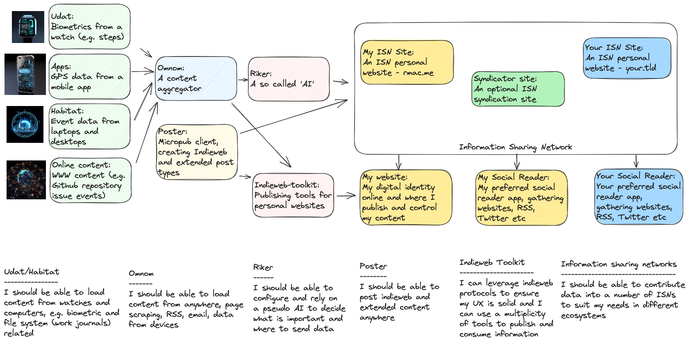

# Vox Machina

An architecture which provides capabilities for better handling the data and events in your life and the enthusiasts who build it.

## About

We want to make it easier and safer to collect the important events and data in your life, bring them together in one place and make provide capabilities to help you understand what to do them, how to transform and represent them and how to share them.

## High level architecture

While thinking and designing it seemed sensible to start drafting early diagrams to help conceptualise how this might work.

